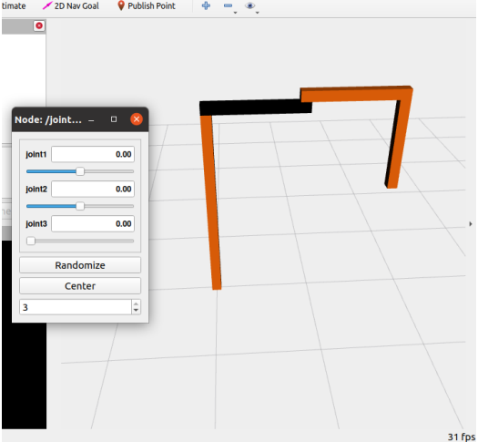
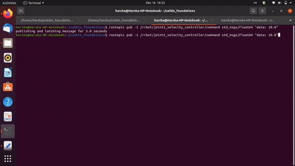

# Position-and-Velocity-control-of-a-6-DOF-manipulator

## Simulation of SCARA Robot

The simulation was created in Gazebo. To read the joint values from Gazebo, Joint State Publisher GUI was included in the launch file. Using these sliders, joint values can be manually set and are then published to the joint_state topic. 

## Forward Kinematics

Using the fk.py script, forward kinematics of the robot was solved. The script listens to the joint_state topic and calculates the end-effector position using the homogenous transformation matrix.

## Inverse Kinematics

ik_server.py calculates the joint values for the given values of position and orientation of the end-effector.

## Position Control

To control each of the joints, ros_control package was used. PID control was implemented and rqt_gui was used to visualize joint motion with the corresponding PID values. These values can be adjusted and published directly to the joint position control commands. PID values were manually tuned for every joint assuring minimum overshoot and minimum time required for the robot to reach the target position.

Using these joint controllers, robot was moved far away from its singular configuration to ensure maneuverability.

## Velocity Control

A script velocity_server.py was created which can perform forward as well as inverse velocity kinematics based on the service called. For each joint, a velocity controller was defined in the rrbot_control.launch file. PID values for each velocity controller were assigned in the rrbot_control.yaml file. The ros_control package reads the velocity data and translates it into joint velocities using Jacobian. These joint velocity values are then used for robot simulation. 

## Path Tracing 

Now that all the robot is away from singular configration and velocity controllers have been defined, a constant velocity input along the y direction is given. As a result, robot traces a straight line path along the y direction. This, along with the MATLAB plot of reference vs actual joint velocities can be seen below.

## References

<a id="1">[1]</a> 
Osrf. “URDF in Gazebo.” Gazebo, http://gazebosim.org/tutorials?tu t=ros_urdf.

<b id="1">[2]</b> 
Layhue, Colton. “Inverse Kinematics - SCARA Manipulator.” Youtube, 8 Mar. 2021, 
https://m.youtube.com/watch?v=c5Z4h7gvIYA&t=868s.

